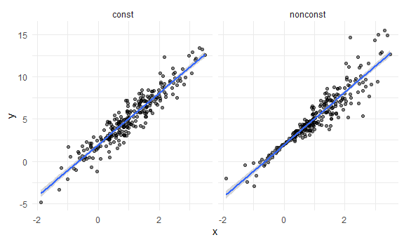
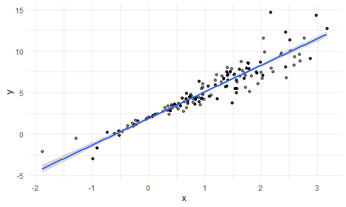
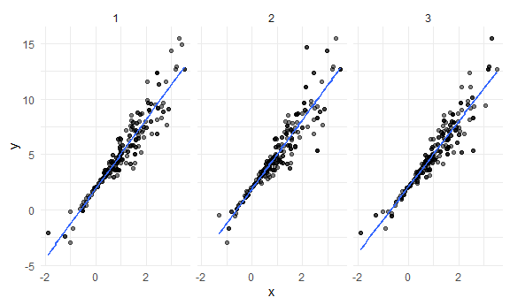
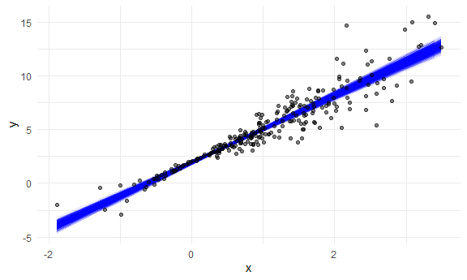
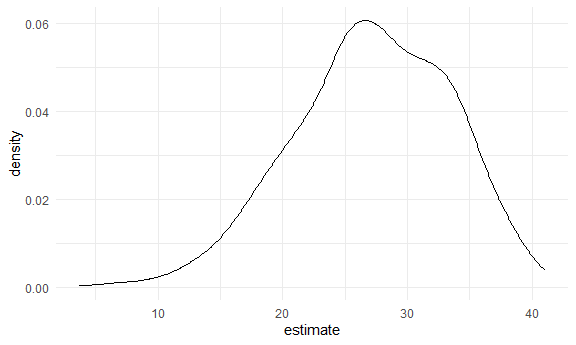

bootstrapping
================

## 1. Load packages and set seed

``` r
library(tidyverse)
library(p8105.datasets)

set.seed(1)
```

What this does: - `tidyverse` → data cleaning + plotting -
`p8105.datasets` → class datasets - `set.seed(1)` → makes random results
identical each time

# What is bootstrapping?

In the real world, you only get one sample. Bootstrapping lets you
resample your sample, with replacement, many times. Each resample =
“fake dataset” that mimics taking a new sample from the population. You
fit your model to each resample. The variability across all bootstrap
samples = the uncertainty of your estimates.

## 2. Simulated data (constant vs. non-constant variance)

``` r
n_samp = 250
```

## create data with constant variance

``` r
sim_df_const = 
  tibble(
    x = rnorm(n_samp, 1, 1),
    error = rnorm(n_samp, 0, 1),
    y = 2 + 3 * x + error
  )
```

## create data with non-constant variance

``` r
sim_df_nonconst = sim_df_const |> 
  mutate(
    error = error * .75 * x,
    y = 2 + 3 * x + error
)
```

Meaning: - Both datasets follow the same regression line - But the noise
changes in the second dataset depending on x - (Non-constant variance =
heteroscedasticity)

## Plot the two datasets

``` r
sim_df = 
  bind_rows(const = sim_df_const, nonconst = sim_df_nonconst, .id = "data_source") 

sim_df |> 
  ggplot(aes(x = x, y = y)) + 
  geom_point(alpha = .5) +
  stat_smooth(method = "lm") +
  facet_grid(~data_source)
```

    ## `geom_smooth()` using formula = 'y ~ x'



Shows: - left panel = constant variance - right panel = non-constant
variance

## 3. Fit ordinary linear regression to both datasets

``` r
lm(y ~ x, data = sim_df_const) |> broom::tidy()
```

    ## # A tibble: 2 × 5
    ##   term        estimate std.error statistic   p.value
    ##   <chr>          <dbl>     <dbl>     <dbl>     <dbl>
    ## 1 (Intercept)     1.98    0.0981      20.2 3.65e- 54
    ## 2 x               3.04    0.0699      43.5 3.84e-118

``` r
lm(y ~ x, data = sim_df_nonconst) |> broom::tidy()
```

    ## # A tibble: 2 × 5
    ##   term        estimate std.error statistic   p.value
    ##   <chr>          <dbl>     <dbl>     <dbl>     <dbl>
    ## 1 (Intercept)     1.93    0.105       18.5 1.88e- 48
    ## 2 x               3.11    0.0747      41.7 5.76e-114

Observation: Even though variances are different, standard errors look
similar, not good. We need a better way -\> bootstrap.

## BOOTSTRAPPING

## 4. Function to draw ONE bootstrap sample

``` r
boot_sample = function(df) {
  sample_frac(df, replace = TRUE)
}
```

Meaning: - Takes a dataset - Randomly samples rows with replacement -
Sample size stays the same

## Check one bootstrap sample

``` r
boot_sample(sim_df_nonconst) |> 
  ggplot(aes(x = x, y = y)) + 
  geom_point(alpha = .5) +
  stat_smooth(method = "lm")
```

    ## `geom_smooth()` using formula = 'y ~ x'



Shows: - similar shape - some repeated points - some missing points

## 5. Create 1,000 bootstrap samples

``` r
boot_straps = 
  tibble(strap_number = 1:1000) |> 
  mutate(
    strap_sample = map(strap_number, \(i) boot_sample(df = sim_df_nonconst))
  )
```

What this does: - Makes a tibble of 1000 rows - Each row = a bootstrap
sample stored in a list column

## Inspect first 3 samples

``` r
boot_straps |> 
  slice(1:3) |> 
  mutate(strap_sample = map(strap_sample, \(s) arrange(s, x))) |> 
  pull(strap_sample)
```

    ## [[1]]
    ## # A tibble: 250 × 3
    ##         x   error       y
    ##     <dbl>   <dbl>   <dbl>
    ##  1 -1.89   1.62   -2.04  
    ##  2 -1.89   1.62   -2.04  
    ##  3 -1.21  -0.781  -2.43  
    ##  4 -1.21  -0.781  -2.43  
    ##  5 -1.00   0.832  -0.169 
    ##  6 -0.989 -1.97   -2.93  
    ##  7 -0.914 -0.908  -1.65  
    ##  8 -0.606 -0.106   0.0774
    ##  9 -0.536  0.0227  0.413 
    ## 10 -0.524 -0.536  -0.106 
    ## # ℹ 240 more rows
    ## 
    ## [[2]]
    ## # A tibble: 250 × 3
    ##         x  error       y
    ##     <dbl>  <dbl>   <dbl>
    ##  1 -1.29   1.40  -0.454 
    ##  2 -0.989 -1.97  -2.93  
    ##  3 -0.914 -0.908 -1.65  
    ##  4 -0.914 -0.908 -1.65  
    ##  5 -0.805  0.292 -0.123 
    ##  6 -0.805  0.292 -0.123 
    ##  7 -0.665 -0.544 -0.539 
    ##  8 -0.641 -0.416 -0.338 
    ##  9 -0.606 -0.106  0.0774
    ## 10 -0.606 -0.106  0.0774
    ## # ℹ 240 more rows
    ## 
    ## [[3]]
    ## # A tibble: 250 × 3
    ##         x  error      y
    ##     <dbl>  <dbl>  <dbl>
    ##  1 -1.89   1.62  -2.04 
    ##  2 -1.89   1.62  -2.04 
    ##  3 -1.29   1.40  -0.454
    ##  4 -1.29   1.40  -0.454
    ##  5 -1.00   0.832 -0.169
    ##  6 -0.914 -0.908 -1.65 
    ##  7 -0.805  0.292 -0.123
    ##  8 -0.665 -0.544 -0.539
    ##  9 -0.665 -0.544 -0.539
    ## 10 -0.665 -0.544 -0.539
    ## # ℹ 240 more rows

shows: - repeated rows - missing rows - different structure each time

## Plot first 3 bootstrap samples with their regression lines

``` r
boot_straps |> 
  slice(1:3) |> 
  unnest(strap_sample) |> 
  ggplot(aes(x = x, y = y)) + 
  geom_point(alpha = .5) +
  stat_smooth(method = "lm", se = FALSE) +
  facet_grid(~strap_number)
```

    ## `geom_smooth()` using formula = 'y ~ x'



Shows how bootstrap samples differ.

## Analyze ALL bootstrap samples

## 6. Fit regression to every bootstrap sample (+ tidy)

``` r
bootstrap_results = 
  boot_straps |> 
  mutate(
    models = map(strap_sample, \(df) lm(y ~ x, data = df)),
    results = map(models, broom::tidy)) |> 
  select(-strap_sample, -models) |> 
  unnest(results)
```

This: - fits 1000 regressions - extracts coefficients - binds them into
one big dataset

## Compute bootstrap standard errors

``` r
bootstrap_results |> 
  group_by(term) |> 
  summarize(boot_se = sd(estimate))
```

    ## # A tibble: 2 × 2
    ##   term        boot_se
    ##   <chr>         <dbl>
    ## 1 (Intercept)  0.0747
    ## 2 x            0.101

Bootstrap SEs reflect the unusual variance pattern.

## Bootstrap 95% confidence intervals

``` r
bootstrap_results |> 
  group_by(term) |> 
  summarize(
    ci_lower = quantile(estimate, 0.025), 
    ci_upper = quantile(estimate, 0.975))
```

    ## # A tibble: 2 × 3
    ##   term        ci_lower ci_upper
    ##   <chr>          <dbl>    <dbl>
    ## 1 (Intercept)     1.79     2.08
    ## 2 x               2.91     3.31

This uses the empirical bootstrap distribution.

## Visualize regression lines from bootstrap samples

``` r
boot_straps |> 
  unnest(strap_sample) |> 
  ggplot(aes(x = x, y = y)) + 
  geom_line(aes(group = strap_number), stat = "smooth", method = "lm", se = FALSE, alpha = .1, color = "blue") +
  geom_point(data = sim_df_nonconst, alpha = .5)
```

    ## `geom_smooth()` using formula = 'y ~ x'



Interpretation: - lines bunch together around x = 0 → smaller variance -
lines spread at extremes → larger variance This matches the data
generation.

## Faster bootstrapping using `modelr::bootstrap()`

## 7. Automatic bootstrapping

``` r
boot_straps = 
  sim_df_nonconst |> 
  modelr::bootstrap(n = 1000)
```

This creates resample objects (saves memory).

## view one bootstrap sample

``` r
boot_straps |> pull(strap) |> nth(1) |> as_tibble()
```

    ## # A tibble: 250 × 3
    ##         x  error     y
    ##     <dbl>  <dbl> <dbl>
    ##  1  1.74   0.747  7.96
    ##  2  0.411  0.343  3.58
    ##  3  1.15  -1.12   4.34
    ##  4 -0.157 -0.159  1.37
    ##  5  2.21  -1.13   7.50
    ##  6  2.34   0.488  9.52
    ##  7  0.946 -0.498  4.34
    ##  8  1.21   1.55   7.17
    ##  9  2.52   0.528 10.1 
    ## 10  2.34   0.488  9.52
    ## # ℹ 240 more rows

## full bootstrap pipeline (automatic version)

``` r
sim_df_nonconst |> 
  modelr::bootstrap(n = 1000) |> 
  mutate(
    models = map(strap, \(df) lm(y ~ x, data = df)),
    results = map(models, broom::tidy)) |> 
  select(-strap, -models) |> 
  unnest(results) |> 
  group_by(term) |> 
  summarize(boot_se = sd(estimate))
```

    ## # A tibble: 2 × 2
    ##   term        boot_se
    ##   <chr>         <dbl>
    ## 1 (Intercept)  0.0790
    ## 2 x            0.104

Same result as before, but cleaner.

## Do the same for constant-variance dataset

``` r
sim_df_const |> 
  modelr::bootstrap(n = 1000) |> 
  mutate(
    models = map(strap, \(df) lm(y ~ x, data = df)),
    results = map(models, broom::tidy)) |> 
  select(-strap, -models) |> 
  unnest(results) |> 
  group_by(term) |> 
  summarize(boot_se = sd(estimate))
```

    ## # A tibble: 2 × 2
    ##   term        boot_se
    ##   <chr>         <dbl>
    ## 1 (Intercept)  0.101 
    ## 2 x            0.0737

## AIRBNB Example

## 8. Load and clean data

``` r
data("nyc_airbnb")

nyc_airbnb = 
  nyc_airbnb |> 
  mutate(stars = review_scores_location / 2) |> 
  rename(
    borough = neighbourhood_group,
    neighborhood = neighbourhood) |> 
  filter(borough != "Staten Island") |> 
  drop_na(price, stars) |> 
  select(price, stars, borough, neighborhood, room_type)
```

## Quick plot

``` r
nyc_airbnb |> 
  ggplot(aes(x = stars, y = price, color = room_type)) + 
  geom_point() 
```


Outliers in price are clearly visible.

## Bootstrap regression coefficients for Manhattan listings

``` r
nyc_airbnb |> 
  filter(borough == "Manhattan") |> 
  modelr::bootstrap(n = 1000) |> 
  mutate(
    models = map(strap, \(df) lm(price ~ stars + room_type, data = df)),
    results = map(models, broom::tidy)) |> 
  select(results) |> 
  unnest(results) |> 
  filter(term == "stars") |> 
  ggplot(aes(x = estimate)) + geom_density()
```



Meaning: - we look at the distribution of the star-rating coefficient -
the distribution has heavy tails - caused by high-price outliers
appearing in some bootstrap samples
