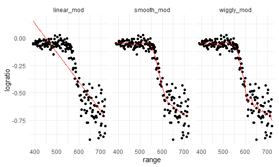

cross_validation
================

## 1. Load packages and set seed

``` r
library(tidyverse)
library(modelr)
library(mgcv)
library(p8105.datasets)

set.seed(1)
```

What this does:

- tidyverse → cleaning & plotting tools
- modelr → tools for predictions & cross-validation
- mgcv → fits smooth/non-linear models
- p8105.datasets → loads class datasets
- set.seed(1) → makes random results repeatable

## 2. Load LIDAR data

``` r
data("lidar")

lidar_df = 
  lidar |> 
  as_tibble() |>
  mutate(id = row_number())
```

What this does: - loads dataset `lidar` - converts it to a tibble (nicer
dataframe) - adds an ID column to identify rows later

## Plot the raw data

``` r
lidar_df |> 
  ggplot(aes(x = range, y = logratio)) + 
  geom_point()
```


Shows how `logratio` changes with `range`.

## 3. Train-test splint

``` r
train_df = sample_frac(lidar_df, size = .8)
test_df = anti_join(lidar_df, train_df, by = "id")
```

What this does: - takes 80% of the data randomly → training set - the
other 20% (not selected) → test set - uses `anti_join` so no duplicates

## Plot training (black) vs test (red)

``` r
ggplot(train_df, aes(x = range, y = logratio)) + 
  geom_point() + 
  geom_point(data = test_df, color = "red")
```


Shows which points were used to train vs test.

## 4. Fit three models (different complexity)

``` r
linear_mod = lm(logratio ~ range, data = train_df)
smooth_mod = mgcv::gam(logratio ~ s(range), data = train_df)
wiggly_mod = mgcv::gam(logratio ~ s(range, k = 30), sp = 10e-6, data = train_df)
```

What these do: - `linear_mod` → simple straight line - `smooth_mod` →
smooth curve - `wiggly_mod` → VERY flexible curve (too wiggly)

## Plot each GAM fit

``` r
train_df |> 
  add_predictions(smooth_mod) |> 
  ggplot(aes(x = range, y = logratio)) + 
  geom_point() + 
  geom_line(aes(y = pred), color = "red")
```


This overlays smooth curve.

``` r
train_df |> 
  add_predictions(wiggly_mod) |> 
  ggplot(aes(x = range, y = logratio)) + 
  geom_point() + 
  geom_line(aes(y = pred), color = "red")
```


Shows the overly-complex fit.

## Compare ALL THREE in one plot.

``` r
train_df |> 
  gather_predictions(linear_mod, smooth_mod, wiggly_mod) |> 
  mutate(model = fct_inorder(model)) |> 
  ggplot(aes(x = range, y = logratio)) + 
  geom_point() + 
  geom_line(aes(y = pred), color = "red") + 
  facet_wrap(~model)
```



Shows: - linear model → too simple - smooth model → good - wiggly model
→ too complex

## 5. Compute RMSE on test data

``` r
rmse(linear_mod, test_df)
```

    ## [1] 0.127317

``` r
rmse(smooth_mod, test_df)
```

    ## [1] 0.08302008

``` r
rmse(wiggly_mod, test_df)
```

    ## [1] 0.08848557

RMSE = average prediction error Lower = better. Smooth model wins.

## 6. Cross-validation automation

``` r
cv_df = crossv_mc(lidar_df, 100)
```

What this does: - repeats train/test split 100 times Each split is
stored in `train` and `test`.

## Convert resample objects → tibbles (needed for GAM)

``` r
cv_df =
  cv_df |> 
  mutate(
    train = map(train, as_tibble),
    test = map(test, as_tibble))
```

## Look at a sample split

``` r
cv_df |> pull(train) |> nth(1) |> as_tibble()
```

    ## # A tibble: 176 × 3
    ##    range logratio    id
    ##    <dbl>    <dbl> <int>
    ##  1   390  -0.0504     1
    ##  2   394  -0.0510     4
    ##  3   396  -0.0599     5
    ##  4   399  -0.0596     7
    ##  5   400  -0.0399     8
    ##  6   402  -0.0294     9
    ##  7   403  -0.0395    10
    ##  8   405  -0.0476    11
    ##  9   406  -0.0604    12
    ## 10   408  -0.0312    13
    ## # ℹ 166 more rows

``` r
cv_df |> pull(test) |> nth(1) |> as_tibble()
```

    ## # A tibble: 45 × 3
    ##    range logratio    id
    ##    <dbl>    <dbl> <int>
    ##  1   391  -0.0601     2
    ##  2   393  -0.0419     3
    ##  3   397  -0.0284     6
    ##  4   412  -0.0500    16
    ##  5   421  -0.0316    22
    ##  6   424  -0.0884    24
    ##  7   426  -0.0702    25
    ##  8   427  -0.0288    26
    ##  9   436  -0.0573    32
    ## 10   445  -0.0647    38
    ## # ℹ 35 more rows

Shows first training and test subsets.

## 7. Fit models for each of the 100 splits

``` r
cv_df = 
  cv_df |> 
  mutate(
    linear_mod  = map(train, \(df) lm(logratio ~ range, data = df)),
    smooth_mod  = map(train, \(df) gam(logratio ~ s(range), data = df)),
    wiggly_mod  = map(train, \(df) gam(logratio ~ s(range, k = 30), sp = 10e-6, data = df)))
```

What this does: For each split: - fit linear - fit smooth GAM - fit
wiggly GAM

## Compute RMSE for each model + split

``` r
cv_df = cv_df |> 
  mutate(
    rmse_linear = map2_dbl(linear_mod, test, \(mod, df) rmse(model = mod, data = df)),
    rmse_smooth = map2_dbl(smooth_mod, test, \(mod, df) rmse(model = mod, data = df)),
    rmse_wiggly = map2_dbl(wiggly_mod, test, \(mod, df) rmse(model = mod, data = df)))
```

## Plot RMSE distributions

``` r
cv_df |> 
  select(starts_with("rmse")) |> 
  pivot_longer(
    everything(),
    names_to = "model", 
    values_to = "rmse",
    names_prefix = "rmse_") |> 
  mutate(model = fct_inorder(model)) |> 
  ggplot(aes(x = model, y = rmse)) + geom_violin()
```


Interpretation: Smooth model is best

## 8. Child growth example

``` r
child_growth = read_csv("nepalese_children.csv")
```

    ## Rows: 2705 Columns: 5
    ## ── Column specification ────────────────────────────────────────────────────────
    ## Delimiter: ","
    ## dbl (5): age, sex, weight, height, armc
    ## 
    ## ℹ Use `spec()` to retrieve the full column specification for this data.
    ## ℹ Specify the column types or set `show_col_types = FALSE` to quiet this message.

Loads data.

## Plot

``` r
child_growth |> 
  ggplot(aes(x = weight, y = armc)) + 
  geom_point(alpha = .5)
```


## Add piecewise change-point term

``` r
child_growth =
  child_growth |> 
  mutate(weight_cp7 = (weight > 7) * (weight - 7))
```

Creates a variable that kicks in only when weight \> 7.

## Fit 3 models

``` r
linear_mod = lm(armc ~ weight, data = child_growth)
pwl_mod    = lm(armc ~ weight + weight_cp7, data = child_growth)
smooth_mod = gam(armc ~ s(weight), data = child_growth)
```

- linear model
- piecewise linear
- smooth GAM

## Plot all models

``` r
child_growth |> 
  gather_predictions(linear_mod, pwl_mod, smooth_mod) |> 
  mutate(model = fct_inorder(model)) |> 
  ggplot(aes(x = weight, y = armc)) + 
  geom_point(alpha = .5) +
  geom_line(aes(y = pred), color = "red") + 
  facet_grid(~model)
```


## Cross-validation

``` r
cv_df =
  crossv_mc(child_growth, 100) |> 
  mutate(
    train = map(train, as_tibble),
    test = map(test, as_tibble))
```

## Fit models for each split

``` r
cv_df = 
  cv_df |> 
  mutate(
    linear_mod  = map(train, \(df) lm(armc ~ weight, data = df)),
    pwl_mod     = map(train, \(df) lm(armc ~ weight + weight_cp7, data = df)),
    smooth_mod  = map(train, \(df) gam(armc ~ s(weight), data = as_tibble(df))))
```

## Copute RMSEs

``` r
cv_df = 
  cv_df |> 
  mutate(
    rmse_linear = map2_dbl(linear_mod, test, \(mod, df) rmse(model = mod, data = df)),
    rmse_pwl    = map2_dbl(pwl_mod, test, \(mod, df) rmse(model = mod, data = df)),
    rmse_smooth = map2_dbl(smooth_mod, test, \(mod, df) rmse(model = mod, data = df)))
```

## Plot RMSE distributions

``` r
cv_df |> 
  select(starts_with("rmse")) |> 
  pivot_longer(
    everything(),
    names_to = "model", 
    values_to = "rmse",
    names_prefix = "rmse_") |> 
  mutate(model = fct_inorder(model)) |> 
  ggplot(aes(x = model, y = rmse)) + geom_violin()
```


